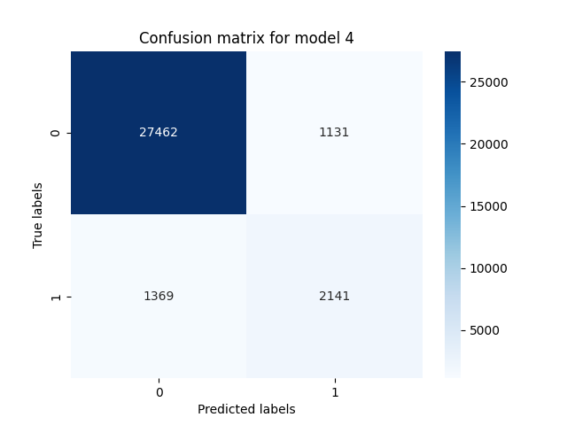
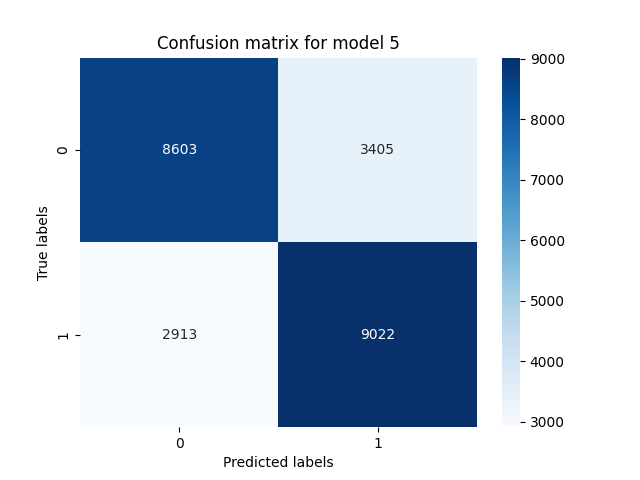
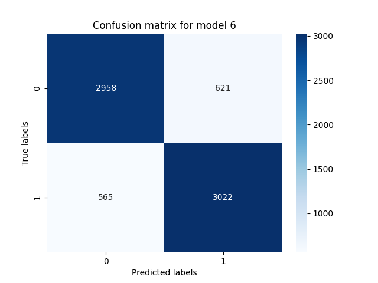

# Rapport de projet - Prédiction de fins de phrases musicales

Loïcia Robart & Gaspar Henniaux

## Analyse préliminaire du projet

Nous avons commencé par bien étudier les données. Nous sommes allés lire les descriptions des différents attributs qui sont donnés dans le dataset pour avoir une vision globale des types de données disponibles et ce qu'elles représentent en terme de musique.  

On comprend que chaque ligne du jeu de données correspond à une mélodie, et chaque colone à une caracteristique de cette mélodie.
Dans une mélodie/chanson, on retrouve plusieurs motifs de notes et donc des départs et fin de mélodies, donc dans chacune de nos lignes (mélodies), on peut trouver plusieurs fin de phrases (une note marquée comme une fin de phrase, c'est à dire que c'est la dernière note d'une sous séquece mélodique).  
Nous avons ensuite réfléchis sur la notion de "fin de phrase" en terme de classification. Cela nous a permis de trouver des attributs tels que phrase_end, phrasepos, beatinphrase et beatinphrase_end qui pourraient nous aider dans cette classification.  

Une autre particularité des données qui nous sont données est que pour une ligne (une méloldie), on peut avoir pour un attribut donnée (une colonne), une valeur sous forme de liste. Ces listes correspondent en réalité à une représentation de la mélodie par notes. Pour prendre un exemple concret et en reprenant notre attribut cité plus haut 'phrase_end', on peut afficher, pour la première mélodie du jeu de donnée, sa valeur (df_phrase['phrase_end'][0]). On récupère alors une liste de booléans, chaque booléan indique pour chaque note de la mélodie (dans l'ordre des notes de la mélodie), si cette note est considérée comme une fin de phrase. Il faudra donc trouver une manière de gérer ces données sous forme de liste.  
Chaque liste a donc une taille équivalente au nombre de notes dans la mélodie dont il est question (ligne du dataset). 

Nous avons affiché pour une certaine ligne l'ensembles de ses valeurs par attribut pour avoir une vision d'ensemble.
Pour visualiser les différentes valeurs possibles d'un attribut, nous avons bouclé sur toutes les lignes du dataset et ajouté au fur et à mesure chaque nouvelle valeur qui aparaissait dans une liste (voir notebook). Cela nous permettait d'avoir une meilleur vision sur l'ensemble de valeurs qu'un attribut pouvait prendre.

## Préparation des données

### Tri manuel dans les features

De nombreux atributs sont directement liés les uns aux autres (voir détail dans le notebook), par exemple, duration, duration_frac et duration_fullname, qui se distinguent simplement par des différences dans la notation. On peut alors ne s'en tenir qu'à un seul. Ces corrélations entre attributs sont déductibles depuis la documentation fournie sur les features.  
D'autres attributs de par leur nature n'ont rien à voir avec les placements de fin de phrase et peuvent donc directement être évincées.  

Ce pré-tri nous a permis de sortir la liste d'attributs plus réduite suivante : 'midipitch', 'chromaticinterval', 'scaledegree', 'timesignature', 'beatstrength', 'metriccontour', 'imaweight', 'imacontour', 'duration', 'durationcontour', 'beatfraction', 'beat', 'restduration_frac', 'phrase_end'. (voir code : **liste des features corrélées selon la doc**) 

### Découpage en sous-séquences

L'objectif de notre modèle sera de prédire à partir d'une séquence de notes si elle est une séquence de fin de phrase musicale. Notre modèle doit donc s'entrainer sur des séquences de notes qui sont pour certaines des séquences de fin de phrase (target à 1) et d'autres non (target à 0) ([voir choix d'étiquetage plus bas](#préparation-des-données)).
Nous avons dans un premier temps réfléchis à un découpage basé sur la notion de mesures en musique (une unité de temps qui organise les rythmes dans une composition musicale). En effet, une phrase musicale s’étend généralement sur un certain nombre de mesures.
Les fins de phrases musicales coïncident souvent avec la fin d’une ou plusieurs mesures, renforçant le sentiment de structure, mais cela dépend du style et de la composition.  

Il serait également possible de s'imaginer diviser chaque séquence (en terme de groupe de notes) par le nombre de fin de phrases de la séquence. Si notre séquence contient 5 notes marquées à 1 pour l'attribut 'phrase_end', alors on divise toutes les notes de cette séquences en 5 pour créer 5 sous-séquences mélodiques.

Une autre approche était de définir un nombre de notes fixe, et de diviser chaque mélodie en plusieurs sous séquences au nombre de notes égal à ce nombre fixé.

La problématique d'aplatissement des données ([voir aplatissement des données plus bas](#préparation-des-données)) qui sont sous forme de listes nous implique de choisir cette seconde solution de découpage en sous-séquences par nombre de notes fixes. 
Au départ nous avions fixé notre nombre de notes à 8 mais nous sommes revenus en arrière pour tester l'impact de différentes valeurs pour ce choix de nombre de notes. 
Ce nombre de notes par sous-séquences peut ainsi être vu comme un paramètre à ajuster dans notre apprentissage pour optimiser les performances des modèles. Nous avons pu ainsi tester des sous séquences avec un total de 4 à 24 notes. (voir code **generate_subsequences**)

Vers la fin de nos apprentissages de modèles nous avons remarqué qu'avec cette approche de division de séquences de notes, si l'on divisait en commençant par le début de notre séquence, et en considérant que les séquences se terminent par une note marquée 1 en 'phrase_end', on perdait beaucoups d'échantillons à 1. En effet le nombre de notes d'une séquence n'est pas necessairement divisible par notre taille de notes de sous-séquences. Ainsi, en effectuant notre division de séquence, on ne gardait que les sous-échantillons avec la taille de notes souhaitée. Cela nous faisait perdre énormément de fins de séquences qui correspondaient aux nombre de notes restante après notre division. Hors ces fins de séquences correspondent presque toujours à des fin de phrases musicales. Nous perdions ainsi de nombreux échantillons qui auraient été marqués positif comme fin de phrase.  
Ainsi, pour améliorer l'apprentissage de nos modèles qui s'entrainaient avec beaucoup plus de sous-séquences étiquetées à 0 qu'à 1, nous avons inversé notre méthode de division. De ce fait, nous avons essayé de diviser en commençant par la fin de la séquence. En prenant donc par exemple les 8 dernières notes de chaque séquences puis les 8 suivantes avant celles-ci, etc. Cela a grandement augmenté notre nombre de sous-séquences qui étaient des fin de phrases, et donc nos scores de prédiction à la fin. (voir code **generate_subsequences(reverse=True)**)

### Choix d'étiquetage 

L'étiquetage consister ici à décider pour chacune de nos sous-séquence d'apprentissage pour les modèles, si sa classe (colonne target -> la valeur que notre modèle devra prédire) est 1 (sous-sequence correspondant à une fin de phrase) ou 0 (la sous-séquence n'est pas une fin de phrase).  

La notion de séquence musicale qui correspond à une fin de phrase était assez floue pour nous. Nous avons ainsi décidé de tester plusieurs approches.  
Dans une première tentative, nous avons décidé d'étiqueter chaque sous-séquence contenant au moins une note marquée comme fin de phrase (phrase_end à true) à 1. Si la sous-séquence ne contient aucune fin de phrase parmis toute ses notes, la classe est notée à 0. (voir code **transform_target_any**)  

Après quelques calculs de score moyens depuis cet étiquetage, cette approche ne nous semblait pas optimale en terme de logique. En effet si la note marquant la fin de phrase est en début de sous-séquence, on peut considérer que toutes les notes suivantes dans cette sous-séquence correspondent en réalité à une progression de note pour le début de la phrase mélodique suivante. Cela brouille l'apprentissage car la sous-séquence aurait quand même été considérée comme une séquence de fin de phrase alors que la majorité des notes dans cette séquence auraient en réalité été en lien avec un début de phrase musicale.  

Nous avons donc décidé de revenir en arrière pour étiqueter nos sous-séquences différement. Pour ce faire, on ne marque à 1 une séquence seulement si la dernière note de celle-ci est elle-même marqué comme une fin de phrase (son attribut 'phrase_end' est à 1). (voir code **transform_target_end**)    

A la fin, nous sommes une nouvelle fois revenus sur cette étape pour tester l'impact de ce choix d'étiquetage de menière plus précise. Cela a été possible grâce à un étiquetage "hybride". Nous avons varié la distance maximale, de la fin de la séquence de notes, à laquelle pouvait se trouver une note marquée comme fin de phrase pour qur la séquence soit classée 1. Cela nous donne un nouveau paramètre à ajuster pour tester des scores, nous avons essentiellement essayé jusqu'à 4. (voir code **transform_target_hybrid**)  

Nous avons biensur retiré l'attribut 'phrase_end' de nos attributs dans notre dataframe pour l'apprentissage des modèles. Cela aurait été équivalent à donner la réponse au modèle et lui demander de prédire cette même réponse. 

### Transformation des données  

Une partie des données n'était pas en valeurs numérique, il a donc fallu transformer les attributs en question pour n'avoir à la fin que des valeurs numériques dans le dataframe. (voir code : **transform_features**)  

Les règles sont les suivantes :   
- 'chromaticinterval': remplace None par 0.
- 'tonic': encode les valeurs en vecteurs binaires selon 21 possibilités.
- 'mode': encode les valeurs en vecteurs binaires selon 6 possibilités.
- 'timesignature': convertit les fractions en nombres décimaux.
- 'beatfraction': convertit les fractions en nombres décimaux.
- 'metriccontour', 'imacontour', 'durationcontour': transforme les chaînes en 1, -1 ou 0.
- 'restduration_frac': convertit les fractions en nombres décimaux, remplace None par 0.  

L'intêret de convertir une valeur de type string (une valeur catégorielle) en vecteur binaire, vient du soucis de ne pas attribuer de poids à certaines valeurs. En effet, si on prend par exemple l'attribut 'mode', qui peut prendre une valeur parmis : 'major', 'minor', 'dorian', 'phrygian', 'lydian', 'mixolydian'. Si on avait remplacé chaque mode par un numéro, cela aurait implicitement engendré un ordonnancement entre les modes. Pour rester neutre, il vaut mieux représenter toutes les possibilités dans un vecteur binaire, ici de taille 6, une valeur binaire pour chaque mode selon si il est selectionné (1) ou pas (0).

### Applatissement des données

L'applatissement des données est une étape clé pour transformer des structures de données complexes, comme nos colonnes contenant des listes (l'attribut 'mode' par exemple), en un format tabulaire classique adapté à l'apprentissage de modèles de machine learning.  
Pour ce faire, dans notre code, on parcourt les différentes colonnes du dataframe et on considère 2 cas :  

- l'attribut contient des valeurs unique, on conserve alors la valeur telle quelle.  
- l'attribut contient des valeurs sous forme de liste de valeurs ( nos vecteurs binaires par exemple ). Dans ce cas, chaque élément de cette liste est extrait et attribué à une nouvelle colonne avec un suffixe d'index (_0, _1, etc.).  

Avec ce traitement, si parmis nos attributs on trouve des vecteurs de taille 6, alors on remplacera cet attribut par 6 nouveaux attributs correspondants à chacune des valeurs de ce vecteur. (voir code : **flatten_dataframe**)  

Étant donné que la taille des listes dans les colonnes de notre DataFrame correspond au nombre de notes de chaque ligne (représentant une sous-séquence mélodique), il est essentiel que toutes les sous-séquences contiennent le même nombre de notes. Cela garantit que les colonnes du DataFrame restent cohérentes et alignées avec les notes de chaque ligne.  
Cela justifie notamment notre choix final de découper nos sous-séquences selon le même nombre fixe de notes, indépendemment des spécificités des différentes séquences d'origine.

### Equilibrage des classes

L'intêret de cet étape nous est apparu après le calcul de premières métriques après l'entrainement de nos modèles. A ce moment de notre projet, nous avions alors déjà un très haut score sans beaucoup de traitement, mais cela s'expliquait par le déséquilibre entre nos classes.  
En effet, avec notre étiquetage de 1 plus strict (en acceptant que des sous-séquence avec la dernière note marquée comme fin de phrase), on se retrouve avec énormément plus de sous-séquence de classe 0 que de classe 1.  
L'effet de classe majoritaire biaise ainsi nos résultats (la classe majoritaire étant ici 0). On le remarque notamment avec un recall (capacité à identifier correctement les instances positives) très bas. Nos modèle ont tendance à beaucoup prédire la classe majoritaire pour améliorer le score mais on passe à coté de beaucoup d'instance positives.  

Pour contrer ce biais, nous avons rajouté un traitement des données qui consiste à prendre le même nombre de sous-séquences pour chaque classe. (voir code **balance_classes**). D'où l'intêret de commencer nos divisions de sous-séquences par la fin des séquences pour récupérer un maximum d'instances positives dans notre dataframe et que cet équilibrage ne nous fasse pas perdre trop d'instances.  

### Utilisation du scaler  

Comme dernière étape de notre pré-traitement des données, nous avons également eu recours à un scaler (standardScaler). Un scaler permet de normaliser nos valeurs numériques. Cela permet de mettre à la même échelle les différents attributs et donc de minimiser les biais de convergence des algorithmes, qui auraient pu être induits par des échelles différentes des variables. (voir code **standardScaler()**)  
Nous avons ainsi pu effectuer des comparaisons de performance avec et sans utilisation du scaler.

## Apprentissage des modèles

### Démarche
Dans un premier temps, pour tester et avoir une idée de ce qui fonctionnait et ce qui était cohérent dans notre traitement des données, nous avons essentiellement utilisé un modèle MLPClassifier (Multi-Layer Perceptron). En sachant que c'est un modèle partciulièment efficace pour des problèmes de classification, comme le notre. D'autant plus avec des données complexes, ce qui est le cas dans ce projet. Nous avons également considéré avoir suffisament de données pour l'entrainer. Ce premier choix explique également notre emploi d'un scaler. En effet, ce type de modèle est connu pour être très sensible aux échelles des données en raison de l’utilisation de fonctions d’activation comme sigmoid ou tanh.  

A partir de ce premier choix de modèle, nous avons pu tester les paramètres de notre traitement des données. Notamment comme évoqué plus haut, le choix de la classification, le degré de la dernière note regardé pour vérifier si elle est une fin de phrase, la méthode de découpage en sous séquences (inversé ou non), le nombre de notes par sous séquences, l'équilibrage ou non des classes, l'utilisation du scaler. ([voir résultats](#préparation-des-données)).  

A la suite de cette première analyse et après avoir obtenu des score relativement satisfaisants, nous avons souhaité élargir notre apprentissage à d'autres modèles. 

Nous avons donc créé une liste avec les modèles à tester, on retrouve :  

- Logistic Regression
 - SVM
 - Random Forest
 - KNN
- MLP
 - Naive Bayes
- Decision Tree 
 - SGD   

Puis en parcourant cette liste de modèles, pour chacun d'eux nous avons créé une pipeline nous permettant d'appliquer le scaler puis l'apprentissage. Nous avons ensuite observé le score moyen pour chaque modèle, grâce à la moyenne des score calculés avec une cross-validation. 
Dans tous nos calculs de score, nous avons fait appel à la cross-validation. Cela permet une évaluation plus fiable du modèle et de sa capacité à généraliser sur de nouvelles données non vues.  

A cette étape, randomForest présentait le meilleur score (0.934), suivi de près par SVM (0.931) et MLP (0.928). ([voir résultats](#préparation-des-données)).  

Nous voulions à partir de là mieux prendre en compte l'ajustement des hyperparamètres pour optimiser au maximum les performances de nos modèles. Nous avions déjà manuellement testé, grâce à des boucles, les meilleurs hyperparamètres pour notre modèle MLP. Notamment pour comparer l'emploi de relu face au tanh, la valeur d'alpha, le learning_rate et le nombre d'itérations maximum.  
Après avoir vu que random forest semblait être le plus performant, nous avions également utilisé une grid search sur celui-ci pour ajuster les hyperparamètres tel que la profondeur maximale de l'arbre (model__max_depth) ou encore le nombre minimum d’échantillons requis pour qu’un nœud devienne une feuille (model__min_samples_leaf).([voir résultats](#préparation-des-données))  

Et nous souhaitions donc automatiser ces recherches d'hyperparamètres pour les différents modèles, avec les fonctions de scikit learn adaptées. Nous avons décidé d'éliminer déjà certains modèles qui ont donné des score beaucoup trop bas. On peut citer Naive Bayes ou KNN, qui sont des modèles moins adaptés pour notre problème. 

Pour ce faire, nous avons construit un dictionnaire (voir code **param_grids**). Dans celui-ci, pour chacun des 5 meilleurs modèles parmis ceux cité précèdemment (SVM, MLP, gradiantBoosting, LogisticRegression, RandomForest), on associe une liste d'hyperparamètres en lien avec le modèle. Et pour chaque hyperparamètre, on donne une liste de valeurs possibles à tester.  

Nous créons ensuite un second dictionnaire (voir code **pipelines**), qui pour chaque nom de modèle, créé une pipeline qui applique le scaler puis créé le modèle.  
A la suite de cela, nous avons préparé une fonction (voir code **perform_grid_search**), qui applique une gridSearch (méthode d’optimisation systématique utilisée pour trouver les meilleures valeurs d’hyperparamètres pour un modèle de machine learnin), puis entraine les modèles en fonction et retourne les meilleures paramètres ainsi que les scores.  

En parcourant nos modèles, on applique cette fonction avec la pipeline et les hyperparamètres correspondants depuis nos dictionnaires cités plus haut.  
Cette recherche d'hyperparamètre a été croisée avec des tests d'ajustements de paramètres depuis le traitement des données (le nombre de notes par sous-séquences par exemple).

### mentionner boucle sur longueur ou pas ?

## Résultats

### Choix des métriques de scores  

Dans un premier temps, nous nous referions simplement au score donné par la fonction 'score' des différents modèles importés de scikit learn. Cette fonction se base sur une métrique par défaut associée à la classe de modèle utilisée. Elle varie donc en fonction du type de problème. Avec des problèmes de classification, la métrique par défaut est l'accuracy (proportion de prédictions correctes effectuées par le modèle par rapport au nombre total d'exemples).  
Nous avons rapidement réalisé que cette métrique n'était pas suffisante dans notre contexte de par le déséquilibre dans nos classes ( si on ne les équilibre pas ). Dans ce cas, le score peut être très élevé malgré que le modèle soit peu performant. Nous avons donc regardé d'autres métriques.

Pour évaluer les performances du modèle, et visualiser simplement et succintement un maximum d'informations, nous avons utilisé la fonction classification_report de la bibliothèque Scikit-learn. Cette fonction permet d'obtenir un résumé très complet des performances du modèle pour chaque classe, en calculant plusieurs métriques clés.  

Nous avons notamment étudié le f1 score, la proportion des prédictions correctes parmi toutes les instances prédites comme appartenant à une classe donnée. Cette métrique est efficace face à des classes déséquilibrées comme ça a pu être le cas dans notre projet.  

Dans le contexte de notre projet, nous avons également attentivement regardé le rappel (recall), soit la proportion des vrais positifs identifiés correctement parmi tous les exemples réellement positif. Ici il nous aide donc à mesurer la capacité du modèle à détecter les instances de la classe minoritaire. De ce fait on peut vérifier que le modèle n'est pas trop biaisé par notre classe majoritaire et arrive bien à detecter et prédire des fin de phrases.  

Pour visualiser de manière plus graphique les prédictions concrètes des différents modèle, nous avons opté pour la matrice de confusion. Pour simplifier l'affichage dans nos différents tests, nous avons créé une fonction intermédiaire (voir code **plot_confusion_matrix**).  Cela nous a permis, à chaque affichage, d'ajouter un titre mais également de facilement sauvegarder en format png nos matrices.  

### Valeurs des résultats  

Par soucis de clarté, nous ne présentons ici que les résultats clés et pertinents dans notre démarche et notre progression. D'aures résultats plus détaillés sont cependant disponibles dans le notebook.  

- Premiers essais, avec un modèle MLP et un étiquetage 'any' (si une fin de note se trouve dans la sous-séquence, elle est classée 1) : score autour de 0.6 et 0.7 selon les hyperparamètres testés.  
- On change donc l'étiquetage à 'end' (la séquence est classée à 1 si la dernière note est une fin de phrase), toujours avec MLP.
    
    - sans scaler : 0.91  

     

    - avec scaler : 0.93  

      

- Les résultats nous donnent l'impression que le modèle est biaisé par la classe majoritaire. On reteste le modèle MLP avec scaler mais avec l'équilibrage des classes.  

    - any label : 0.75  

      

    -end label : 0.87 

      

- On essaye à présent de croiser l'impact de longueurs de sous-séquences différentes avec des étiquetages différents, toujours un modèle MLP avec scaler et avec des classes équilibrées. (voici quelques résultats)  

    - longueur 4 label end : 0.86  

      

    - longueur 4 label end jusqu'à 4eme note de la fin (any) : 0.83  

      

    - longueur 6 label end : 0.86  

     

    - longueur 6 label end jusqu'à 3eme note de la fin : 0.82  

      

    - longueur 8 label end : 0.87  

      

    - longueur 8 label end jusqu'à 4eme note de la fin: 0.80  

      

    - longueur 10 label end : 0.86  

      

    - longueur 10 label end jusqu'à 2eme note de la fin: 0.83  

      

- Comparaison entre un sous-séquençage classique et en commençant par les notes de fin (reversed) ([voir explication au dessus](#préparation-des-données)). Nous avons gardé les meilleures paramètres des résultats déjà obtenus, donc toujours avec MLP, les classes sont éqilibrées, avec scaler, un étiquetage end label et une longueur de séquence 8 :  

    - classique : 0.87  

      

    - reverse : 0.90  

      

- Comparaison maintenant entre différents modèles. Avec les mêmes paramètres que juste au dessus, en ajoutant le sous-séquençage "reversed". Les Mean cross-validation scores sont :  

    - Logistic Regression: 0.9255508778938977

    - SVM: 0.9310906794335526

    - Random Forest: 0.9344145044735676

    - KNN: 0.7979809001560058

    - MLP: 0.9280437632496057

    - Naive Bayes: 0.7999196789088607

    - Decision Tree: 0.8895727689905273

    - SGD: 0.9131173861016381  

- Random obtient le meilleur score, on regarde ses résultats après une grid search:  

    - Best parameters found by grid search: {'model__max_depth': None, 'model__min_samples_leaf': 1, 'model__min_samples_split': 2, 'model__n_estimators': 300}  

    - Mean cross-validation score with best model: 0.9345992098317941

### Interprétation  

Depuis ces résultats, on peut apprendre plusieurs choses, que ce soit sur les modèles ou les choix de traitement des données.  

- Impact de l'étiquetage ('any' ou 'end')

On remarque que le chois de l'étiquetage a un impact très fort sur les résultats. Les résultats sont systématiquements inférieurs quand l'étiquetage est 'any'. Cela a tendance a brouiller l'apprentissage du modèle.  ([voir explication au dessus](#préparation-des-données))

- Longueur des sous-séquences  

En général, si on a suffisament de sous-séquences à créer, alors il vaut mieux envisager donner de plus grande sous-séquences au modèle pour lui donner plus de contexte, en terme de notes, pour l'apprentissage. IL faut trouver le juste équilibre entre grand nombre de sous-séquences ou grande longueur de sous-séquence. Ici le meilleur choix est 8.  

-  Importance du prétraitement des données (Scaler)  

Les résultats montrent une amélioration des performances lorsque les données sont normalisées avec un scaler. Par exemple, avec l'étiquetage 'end', le score passe de 0.91 (sans scaler) à 0.93 (avec scaler). Cela nous confirme que les méthodes de normalisation sont essentielles pour les modèles sensibles à l'échelle des données, comme  avec celui choisi au départ, MLP.  

-   Classe majoritaire et impact de l'équilibrage  

Les performances initiales observées sur certaines configurations (par exemple, 0.91-0.93) étaient particulièrement élevées et semblaient victimes du biais de la classe majoritaire (visible également dans les matrices de confusion). En équilibrant les classes, les scores sont devenus plus représentatifs de la vrai capacité des modèles, notamment pour les configurations avec 'any' (0.75) et 'end' (0.87).  

- Squençage classique ou inversé (reversed)

Le séquençage inversé des données, en commençant par récupérer des sous-séquences de notes à la fin de la séquence, a permis d'observer une nette différence dans les scores (séquençage inversé : 0.90,  séquençage classique : 0.87). Cela s'explique, comme on peut le voir dans les matrices de confusion, par l'augmentation notable du nombre de sous-séquences classées à 1. Après équilibrage on peut donc garder plus d'exemples des deux classes.  

- Comparaison des modèles

Nos comparaisons entre les modèles montrent que la Random Forest obtient les meilleurs résultats avec un score moyen en cross-validation de 0.9344, suivi de près par les SVM (0.9311) et les MLP (0.9280). Les algorithmes restants tels que le KNN (0.7979) et le Naive Bayes (0.7999) sont, dans notre contexte, beaucoup moins performants. Ce sont des modèles qui capturent moins facilement des relations complexes entre les données.  

- Importance des hyperparamètres

Avec des paramètres optimaux, le meilleur modèle (random Forest ) a atteint une performance en validation croisée de 0.9346, ce qui augmente très légèrement notre résultat précédant. L'ajustement des hyperparamètres permet ainsi d'optimiser un maximum les performances d'un modèle.  

Notre meilleur score global a ainsi été obtenu grâce au modèle Random Forest, avec une étiquetage 'end', une longueur de sous-séquence de 8 notes fixes, un sous-séquençage en partant de la fin, un équilibrage des 2 classes, l'application d'un scaler et enfin l'ajustement des hyper-paramètres grâce à notre gridSearch. Pour un score de 0.9346. 

## Conclusion 

Ce projet a été particulièrement enrichissant en terme de méthodologie. En effet, nous avons du prendre en main une problématique et un jeu de données de zéro, sans indication de solutions ni aides sur l'approche à adopter comme on peut souvent le retrouver en tp.  
Cela signifiait donc prendre un main et gérer tous les aspects de l'apprentissage d'un modèle. Du choix du traitements des données jusqu'aux choix techniques sur les hyperparamètres des modèles.  

Ce qui a pu être difficile au début, a été de toujours revenir en arrière dans nos démarches pour reprendre certaines étapes et retester de nouvelles possibilités.  
En effet, au fur et à mesure du projet, il a fallu remettre en question nos propres choix et notre vision des données pour ne pas rester enfermés dans une solution et cloisonnés à un score.  

A cela s'ajoute donc l'importance d'être organisé dans notre notebook pour ne pas se perdre parmi tous les différents tests.  

Le projet a également été enrichissant d'un point de vue technique car nous avons découvert de nouvelles bibliothèques et fonctions très pratiques, par exemple classification_report.

De plus, nous avons noté l'importance de rester critique face aux scores et leurs significations. Un bon score ne garantie pas systématiquement un bon modèle. IL est important de croiser les résultats et les métriques de score pour réellement comprendre ce qui se cache derrière les chiffres et ce que cela signifie concrétement en terme de prédiction pour le modèle.  

De manière plus globale, il serait intéressant de tester ce projet sur des jeux de données encore plus enrichis, avec des styles de musiques plus diversifiés et récents, de la pop actuelle par exemple. 

# reste a faire 

mettre les bons liens ds le fichier 

---------------------------------------
